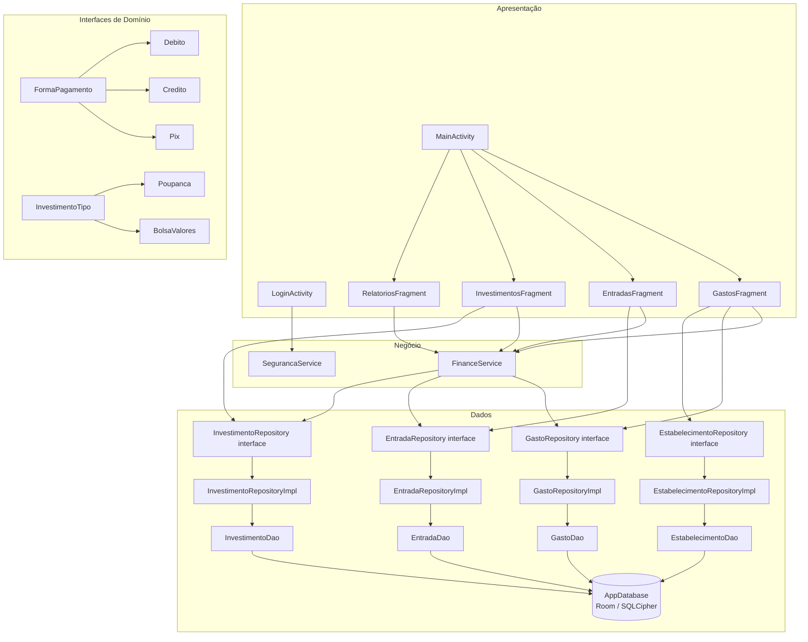
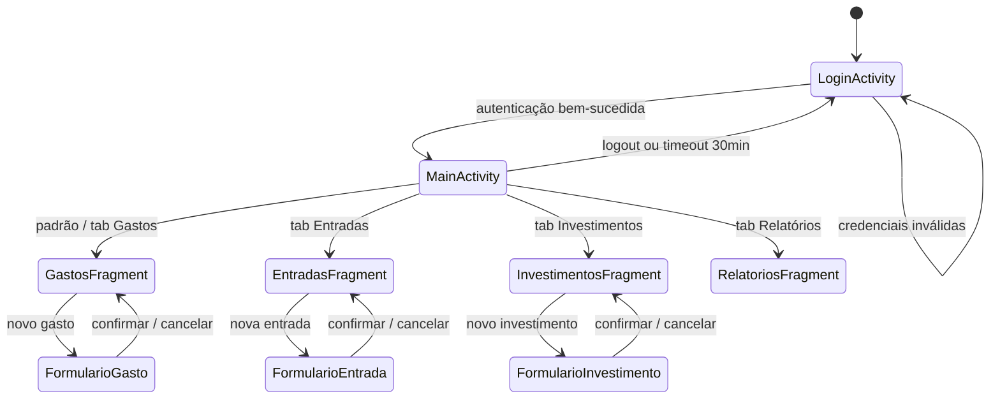
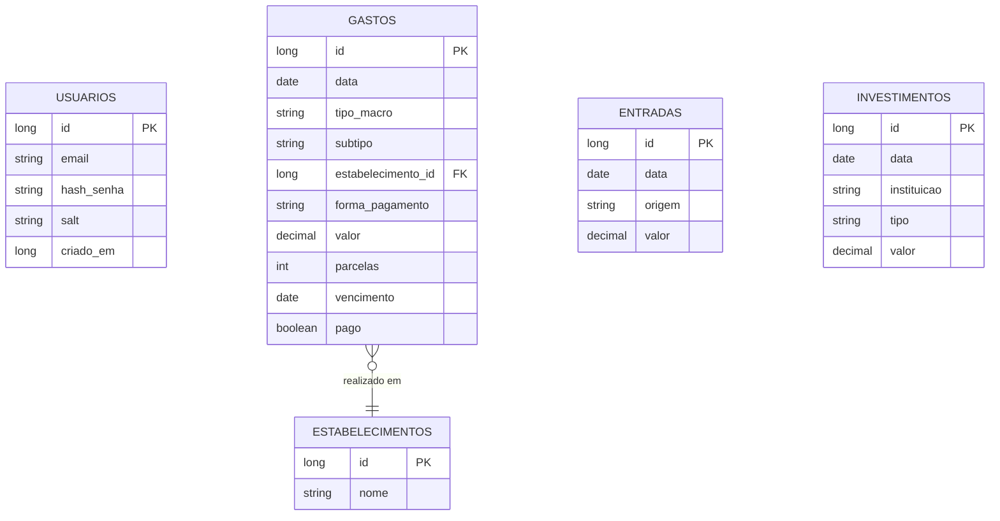

# Design Document — GranaFy App

## Overview

O GranaFy é um aplicativo Android de controle financeiro pessoal desenvolvido em Java. Ele opera completamente offline, com persistência local via Room (SQLite), autenticação baseada em SHA-256 com salt e navegação por módulos usando BottomNavigationView. A arquitetura segue o padrão de três camadas (Apresentação → Negócio → Dados) com interfaces de repositório para garantir extensibilidade futura.

### Objetivos de Design

- **Offline-first**: todos os dados são armazenados localmente; integrações externas são opcionais e não bloqueantes.
- **Segurança por padrão**: senhas nunca em texto simples; sessão com timeout; SharedPreferences criptografado.
- **Extensibilidade**: interfaces de repositório e polimorfismo via `FormaPagamento` e `InvestimentoTipo` permitem evolução sem reescrita.
- **Testabilidade**: camadas desacopladas permitem testes unitários e de propriedade nas regras de negócio sem dependência de Android.

---

## Architecture

### Visão Geral das Camadas

```
┌─────────────────────────────────────────────────────────────┐
│                    CAMADA DE APRESENTAÇÃO                    │
│  LoginActivity  │  MainActivity                             │
│  GastosFragment │  EntradasFragment                         │
│  InvestimentosFragment │  RelatoriosFragment                │
│  (Android XML Layouts + ViewBinding)                        │
└──────────────────────────┬──────────────────────────────────┘
                           │ chama
┌──────────────────────────▼──────────────────────────────────┐
│                    CAMADA DE NEGÓCIO                         │
│  FinanceService  │  SegurancaService                        │
│  (lógica de cálculo, validação, autenticação)               │
└──────────────────────────┬──────────────────────────────────┘
                           │ chama
┌──────────────────────────▼──────────────────────────────────┐
│                    CAMADA DE DADOS                           │
│  Interfaces: GastoRepository, EntradaRepository,            │
│              InvestimentoRepository, EstabelecimentoRepository│
│  Implementações Room: GastoRepositoryImpl, ...              │
│  DAOs: GastoDao, EntradaDao, InvestimentoDao,               │
│        EstabelecimentoDao                                    │
│  AppDatabase (Room + SQLCipher opcional)                    │
└─────────────────────────────────────────────────────────────┘
```

### Diagrama de Componentes (Mermaid)



### Fluxo de Navegação



---

## Components and Interfaces

### Activities

#### LoginActivity
Responsável pela autenticação. Valida formato de email e comprimento mínimo de senha antes de acionar o `SegurancaService`. Gerencia recuperação de senha e persistência de sessão em `SharedPreferences` criptografado.

```java
public class LoginActivity extends AppCompatActivity {
    private SegurancaService segurancaService;
    private SharedPreferences securePrefs;

    void onLoginClick();           // valida campos e chama segurancaService.autenticar()
    void onRecuperarSenhaClick();  // aciona fluxo de recuperação
    void navegarParaMain();        // inicia MainActivity e finaliza LoginActivity
    void salvarSessao(String email, long expiresAt); // persiste em SharedPreferences criptografado
}
```

#### MainActivity
Hospeda a `BottomNavigationView` e o `FragmentContainerView`. Gerencia o ciclo de vida dos fragments sem recriá-los ao alternar abas (usando `FragmentTransaction.hide/show`). Monitora inatividade para timeout de sessão.

```java
public class MainActivity extends AppCompatActivity {
    private BottomNavigationView bottomNav;
    private Handler timeoutHandler;

    void setupNavigation();                    // configura BottomNavigationView
    void showFragment(Fragment fragment);      // hide/show sem recriar
    void resetInactivityTimer();               // reinicia contador de 30min
    void onSessionTimeout();                   // redireciona para LoginActivity
}
```

### Fragments

Todos os fragments seguem o mesmo padrão: lista (RecyclerView) + FAB para novo cadastro + diálogo/bottom sheet de formulário.

| Fragment | RecyclerView Adapter | Formulário |
|---|---|---|
| GastosFragment | GastoAdapter | GastoFormDialog |
| EntradasFragment | EntradaAdapter | EntradaFormDialog |
| InvestimentosFragment | InvestimentoAdapter | InvestimentoFormDialog |
| RelatoriosFragment | — | seletor de período |

### Services

#### SegurancaService
```java
public class SegurancaService {
    // Gera salt aleatório (SecureRandom, 16 bytes, hex)
    public String gerarSalt();

    // Retorna SHA-256(salt + senha) em hex
    public String hashSenha(String senha, String salt);

    // Compara hash informado com hash armazenado
    public boolean autenticar(String emailInformado, String senhaInformada,
                               String hashArmazenado, String saltArmazenado);

    // Verifica se sessão ainda é válida (< 30 dias e < 30min inatividade)
    public boolean sessaoValida(long criadaEm, long ultimaAtividadeEm);
}
```

#### FinanceService
```java
public class FinanceService {
    // Calcula RelatorioFinanceiro para o período informado
    public RelatorioFinanceiro calcularRelatorio(Periodo periodo,
                                                  List<Entrada> entradas,
                                                  List<Gasto> gastos);

    // Filtra lista por intervalo de datas
    public <T extends RegistroFinanceiro> List<T> filtrarPorPeriodo(
            List<T> registros, Date inicio, Date fim);

    // Calcula saldo: totalEntradas - totalGastos
    public BigDecimal calcularSaldo(BigDecimal totalEntradas, BigDecimal totalGastos);
}
```

### Interfaces de Domínio

```java
// FormaPagamento.java
public interface FormaPagamento {
    String getNome();
    boolean aceitaParcelas();
    boolean aceitaVencimento();
}

// Implementações
public class Debito implements FormaPagamento { ... }
public class Credito implements FormaPagamento { ... }  // aceitaParcelas() = true
public class Pix implements FormaPagamento { ... }

// InvestimentoTipo.java
public interface InvestimentoTipo {
    String getNome();
    String getDescricao();
}

// Implementações
public class Poupanca implements InvestimentoTipo { ... }
public class BolsaValores implements InvestimentoTipo { ... }
```

### Interfaces de Repositório

```java
public interface GastoRepository {
    void inserir(Gasto gasto);
    void atualizar(Gasto gasto);
    void deletar(Gasto gasto);
    List<Gasto> listarTodos();
    List<Gasto> listarPorPeriodo(Date inicio, Date fim);
    List<Gasto> listarPorCategoria(String tipoMacro);
    List<Gasto> listarPorEstabelecimento(long estabelecimentoId);
}

public interface EntradaRepository {
    void inserir(Entrada entrada);
    void deletar(Entrada entrada);
    List<Entrada> listarTodos();
    List<Entrada> listarPorPeriodo(Date inicio, Date fim);
}

public interface InvestimentoRepository {
    void inserir(Investimento investimento);
    void deletar(Investimento investimento);
    List<Investimento> listarTodos();
}

public interface EstabelecimentoRepository {
    void inserir(Estabelecimento estabelecimento);
    void deletar(Estabelecimento estabelecimento);
    List<Estabelecimento> listarTodos();
    List<Estabelecimento> buscarPorNome(String fragmento);
    boolean possuiGastosVinculados(long estabelecimentoId);
}
```

---

## Data Models

### Entidades Room

#### Usuario
```java
@Entity(tableName = "usuarios")
public class Usuario {
    @PrimaryKey(autoGenerate = true)
    public long id;

    @NonNull
    @ColumnInfo(name = "email")
    public String email;           // único, formato válido

    @NonNull
    @ColumnInfo(name = "hash_senha")
    public String hashSenha;       // SHA-256 hex, nunca texto simples

    @NonNull
    @ColumnInfo(name = "salt")
    public String salt;            // 16 bytes aleatórios em hex

    @ColumnInfo(name = "criado_em")
    public long criadoEm;          // timestamp Unix ms
}
```

#### Gasto
```java
@Entity(
    tableName = "gastos",
    foreignKeys = @ForeignKey(
        entity = Estabelecimento.class,
        parentColumns = "id",
        childColumns = "estabelecimento_id",
        onDelete = ForeignKey.RESTRICT   // impede exclusão de estabelecimento com gastos
    ),
    indices = {@Index("estabelecimento_id"), @Index("data")}
)
public class Gasto {
    @PrimaryKey(autoGenerate = true)
    public long id;

    @NonNull
    @ColumnInfo(name = "data")
    public Date data;              // data do gasto

    @NonNull
    @ColumnInfo(name = "tipo_macro")
    public String tipoMacro;       // ex.: "Alimentação", "Transporte"

    @ColumnInfo(name = "subtipo")
    public String subtipo;         // opcional

    @ColumnInfo(name = "estabelecimento_id")
    public long estabelecimentoId; // FK → Estabelecimento

    @NonNull
    @ColumnInfo(name = "forma_pagamento")
    public String formaPagamento;  // "DEBITO", "CREDITO", "PIX"

    @NonNull
    @ColumnInfo(name = "valor")
    public BigDecimal valor;       // > 0, máx 999.999.999,99

    @ColumnInfo(name = "parcelas")
    public int parcelas;           // 1–99; relevante apenas para CREDITO

    @ColumnInfo(name = "vencimento")
    public Date vencimento;        // relevante apenas para CREDITO

    @ColumnInfo(name = "pago")
    public boolean pago;           // false por padrão
}
```

#### Entrada
```java
@Entity(tableName = "entradas", indices = {@Index("data")})
public class Entrada {
    @PrimaryKey(autoGenerate = true)
    public long id;

    @NonNull
    @ColumnInfo(name = "data")
    public Date data;              // não pode ser futura

    @NonNull
    @ColumnInfo(name = "origem")
    public String origem;          // "SALARIO", "VENDA", "DOACAO", "OUTRO"

    @NonNull
    @ColumnInfo(name = "valor")
    public BigDecimal valor;       // > 0, máx 999.999.999,99
}
```

#### Investimento
```java
@Entity(tableName = "investimentos", indices = {@Index("data")})
public class Investimento {
    @PrimaryKey(autoGenerate = true)
    public long id;

    @NonNull
    @ColumnInfo(name = "data")
    public Date data;

    @NonNull
    @ColumnInfo(name = "instituicao")
    public String instituicao;     // máx 100 caracteres

    @NonNull
    @ColumnInfo(name = "tipo")
    public String tipo;            // "POUPANCA", "BOLSA_VALORES"

    @NonNull
    @ColumnInfo(name = "valor")
    public BigDecimal valor;       // > 0, máx 999.999.999,99
}
```

#### Estabelecimento
```java
@Entity(tableName = "estabelecimentos")
public class Estabelecimento {
    @PrimaryKey(autoGenerate = true)
    public long id;

    @NonNull
    @ColumnInfo(name = "nome")
    public String nome;            // 2–100 caracteres, único
}
```

### Modelo de Relatório (não persistido)
```java
public class RelatorioFinanceiro {
    public BigDecimal totalEntradas;
    public BigDecimal totalGastos;
    public BigDecimal saldoDisponivel;  // totalEntradas - totalGastos; pode ser negativo
    public Periodo periodo;
    public Date dataInicio;
    public Date dataFim;
    public Map<String, BigDecimal> gastosPorCategoria; // para gráfico de pizza
    public List<PontoEvolucao> evolucaoSaldo;          // para gráfico de linha
}

public class PontoEvolucao {
    public Date referencia;   // dia / semana / mês conforme período
    public BigDecimal saldo;
}

public enum Periodo { DIARIO, SEMANAL, MENSAL, ANUAL }
```

### Diagrama ER



### TypeConverters Room

```java
@TypeConverter
public static Date fromTimestamp(Long value) { ... }

@TypeConverter
public static Long dateToTimestamp(Date date) { ... }

@TypeConverter
public static BigDecimal fromString(String value) { ... }

@TypeConverter
public static String bigDecimalToString(BigDecimal value) { ... }
```

### AppDatabase

```java
@Database(
    entities = {Usuario.class, Gasto.class, Entrada.class,
                Investimento.class, Estabelecimento.class},
    version = 1,
    exportSchema = true
)
@TypeConverters({Converters.class})
public abstract class AppDatabase extends RoomDatabase {
    public abstract GastoDao gastoDao();
    public abstract EntradaDao entradaDao();
    public abstract InvestimentoDao investimentoDao();
    public abstract EstabelecimentoDao estabelecimentoDao();

    // Singleton thread-safe
    private static volatile AppDatabase INSTANCE;

    public static AppDatabase getInstance(Context context) {
        if (INSTANCE == null) {
            synchronized (AppDatabase.class) {
                if (INSTANCE == null) {
                    INSTANCE = Room.databaseBuilder(
                            context.getApplicationContext(),
                            AppDatabase.class, "granafy.db")
                        .build();
                }
            }
        }
        return INSTANCE;
    }
}
```

---

## Security Strategy

### Autenticação e Senhas

1. **Geração de salt**: `SecureRandom` gera 16 bytes aleatórios, codificados em hex.
2. **Hash**: `SHA-256(salt + senha)` — concatenação antes do hash, resultado em hex.
3. **Comparação**: sempre `hashInformado.equals(hashArmazenado)` — nunca comparação de texto simples.
4. **Armazenamento**: `hash_senha` e `salt` na tabela `usuarios`; nunca em logs ou SharedPreferences.

### Sessão

```
┌─────────────────────────────────────────────────────────┐
│  SharedPreferences criptografado (EncryptedSharedPrefs) │
│  chave: "session_email"   → email da usuária            │
│  chave: "session_expires" → timestamp de expiração      │
│  chave: "session_last_activity" → última atividade      │
└─────────────────────────────────────────────────────────┘
```

- Sessão expira em **30 dias** (criação) ou **30 minutos** de inatividade.
- Ao expirar: limpar todas as chaves de sessão e redirecionar para `LoginActivity`.
- `MainActivity` reinicia o timer de inatividade a cada interação do usuário via `onUserInteraction()`.

### Banco de Dados (SQLCipher — opcional)

```java
// build.gradle: habilitar via BuildConfig.SQLCIPHER_ENABLED
if (BuildConfig.SQLCIPHER_ENABLED) {
    INSTANCE = Room.databaseBuilder(...)
        .openHelperFactory(new SupportFactory(passphrase))
        .build();
}
```

### Comunicações de Rede

- Todas as chamadas HTTP futuras devem usar HTTPS.
- `OkHttpClient` configurado com `CertificatePinner` para integrações críticas.
- Dados em cache para fallback quando API indisponível.

---

## Error Handling

| Cenário | Comportamento |
|---|---|
| Credenciais inválidas no login | Mensagem genérica "Email ou senha incorretos" (sem revelar qual campo) |
| Campo obrigatório vazio | Mensagem específica por campo, foco no campo inválido |
| Valor ≤ 0 | Mensagem "O valor deve ser maior que zero" |
| Valor > 999.999.999,99 | Mensagem "O valor informado excede o limite permitido" |
| Data futura em Entrada | Mensagem "A data da entrada não pode ser futura" |
| Falha de escrita no Room | Toast de erro + log interno; dado não é exibido na lista |
| Exclusão de Estabelecimento com gastos | Diálogo de confirmação com opção de cancelar |
| Sem dados no período do relatório | Mensagem "Nenhum dado disponível para o período selecionado" |
| Timeout de sessão | Redirecionamento silencioso para LoginActivity |
| API externa indisponível | Exibir dados em cache; indicador visual de "dados desatualizados" |

### Estratégia de Logging

```java
// Log interno (não exposto ao usuário)
Log.e("GranaFy", "Falha ao inserir gasto: " + e.getMessage(), e);

// Nunca logar: senhas, hashes, salts, tokens de sessão
```

---

## Testing Strategy

### Abordagem Dual

O GranaFy utiliza duas camadas complementares de testes:

1. **Testes unitários com exemplos**: verificam comportamentos específicos, casos de borda e condições de erro nas camadas de negócio e validação.
2. **Testes baseados em propriedades (PBT)**: verificam propriedades universais que devem valer para qualquer entrada válida, especialmente nas regras de cálculo do `FinanceService` e validações do `SegurancaService`.

### Biblioteca de PBT

**jqwik** (Java) — integra com JUnit 5, suporta geradores customizados e shrinking automático.

```groovy
// build.gradle
testImplementation 'net.jqwik:jqwik:1.8.4'
testImplementation 'junit:junit:4.13.2'
testImplementation 'org.mockito:mockito-core:5.11.0'
```

### Configuração de Testes de Propriedade

- Mínimo **100 iterações** por propriedade (padrão jqwik: 1000).
- Cada teste referencia a propriedade do design com tag no Javadoc.
- Formato da tag: `Feature: granafy-app, Property N: <texto da propriedade>`

### Escopo por Camada

| Camada | Tipo de Teste | Ferramenta |
|---|---|---|
| `SegurancaService` | Unitário + Propriedade | JUnit 5 + jqwik |
| `FinanceService` | Unitário + Propriedade | JUnit 5 + jqwik |
| Validações de formulário | Unitário + Propriedade | JUnit 5 + jqwik |
| DAOs Room | Integração (in-memory) | Room Testing + JUnit 4 |
| Fragments / Activities | Instrumentado | Espresso |
| Repositórios | Unitário com mock | Mockito |

### Testes de Integração Room

```java
// Usar banco in-memory para testes de DAO
AppDatabase db = Room.inMemoryDatabaseBuilder(context, AppDatabase.class)
    .allowMainThreadQueries()
    .build();
```

### Testes Instrumentados (Espresso)

- Fluxo de login com credenciais válidas e inválidas.
- Navegação entre os 4 módulos via BottomNavigationView.
- Cadastro completo de Gasto, Entrada e Investimento.
- Exibição de relatório com dados pré-inseridos.


---

## Correctness Properties

*Uma propriedade é uma característica ou comportamento que deve ser verdadeiro em todas as execuções válidas do sistema — essencialmente, uma declaração formal sobre o que o sistema deve fazer. As propriedades servem como ponte entre especificações legíveis por humanos e garantias de corretude verificáveis por máquina.*

### Property 1: Validação de formato de email e senha é universal

*Para qualquer* string de email e senha, a função de validação deve aceitar exatamente os emails que contêm "@" seguido de um domínio não vazio, e as senhas com comprimento ≥ 6 caracteres; qualquer outra combinação deve ser rejeitada.

**Validates: Requirements 1.2, 1.7**

---

### Property 2: Hash de senha é determinístico e irreversível

*Para qualquer* senha e salt, `hashSenha(senha, salt)` deve sempre produzir o mesmo resultado (determinismo), e o resultado nunca deve ser igual à senha original (irreversibilidade). Além disso, para a mesma senha com salts diferentes, os hashes devem ser distintos.

**Validates: Requirements 1.3, 1.10, 7.2**

---

### Property 3: Autenticação é correta para qualquer credencial

*Para qualquer* senha e salt, `autenticar(email, senha, hashSenha(senha, salt), salt)` deve retornar `true`; e para qualquer senha diferente `senhaErrada ≠ senha`, `autenticar(email, senhaErrada, hashSenha(senha, salt), salt)` deve retornar `false`.

**Validates: Requirements 1.3, 1.5**

---

### Property 4: Salts gerados são únicos

*Para qualquer* conjunto de N chamadas a `gerarSalt()`, todos os N valores retornados devem ser distintos entre si.

**Validates: Requirements 7.1**

---

### Property 5: Validade de sessão respeita os limites de tempo

*Para qualquer* timestamp de criação de sessão dentro dos últimos 30 dias e com última atividade dentro dos últimos 30 minutos, `sessaoValida` deve retornar `true`; para timestamps além de 30 dias ou inatividade além de 30 minutos, deve retornar `false`.

**Validates: Requirements 1.11, 7.6**

---

### Property 6: Cálculo de saldo é a diferença exata entre entradas e gastos

*Para quaisquer* valores de `totalEntradas` e `totalGastos` (incluindo casos onde gastos > entradas), `calcularSaldo(totalEntradas, totalGastos)` deve retornar exatamente `totalEntradas - totalGastos`, podendo ser negativo.

**Validates: Requirements 6.2, 6.11**

---

### Property 7: Filtragem por período inclui apenas registros dentro do intervalo

*Para qualquer* lista de registros com datas aleatórias e qualquer intervalo `[inicio, fim]`, `filtrarPorPeriodo(registros, inicio, fim)` deve retornar exatamente os registros cuja data satisfaz `inicio ≤ data ≤ fim`, sem incluir registros fora do intervalo nem excluir registros dentro dele.

**Validates: Requirements 6.3, 6.4, 6.5, 6.6**

---

### Property 8: Validação de valor monetário rejeita valores inválidos e aceita válidos

*Para qualquer* valor numérico `v`, a validação deve retornar `false` se `v ≤ 0` ou `v > 999.999.999,99`, e `true` se `0 < v ≤ 999.999.999,99`.

**Validates: Requirements 3.12, 4.5, 4.6, 5.5, 5.6**

---

### Property 9: Validação de data rejeita datas futuras

*Para qualquer* data `d`, a validação de data de Entrada deve retornar `false` se `d > hoje` e `true` se `d ≤ hoje`.

**Validates: Requirements 4.7**

---

### Property 10: FormaPagamento.aceitaParcelas() é verdadeiro somente para Crédito

*Para qualquer* instância de `FormaPagamento`, `aceitaParcelas()` deve retornar `true` se e somente se a instância for do tipo `Credito`.

**Validates: Requirements 3.3, 3.4**

---

### Property 11: Round-trip de persistência preserva todos os campos

*Para qualquer* registro de `Gasto`, `Entrada` ou `Investimento` gerado com campos válidos aleatórios, inserir o registro no banco de dados Room e recuperá-lo pelo mesmo `id` deve retornar um objeto com todos os campos iguais ao original (incluindo `BigDecimal`, `Date` e campos opcionais).

**Validates: Requirements 8.1, 8.2**

---

### Property 12: Busca de estabelecimentos retorna apenas resultados que contêm o fragmento

*Para qualquer* fragmento de texto não vazio e qualquer lista de estabelecimentos, todos os resultados de `buscarPorNome(fragmento)` devem conter o fragmento informado no nome (case-insensitive); nenhum resultado que não contenha o fragmento deve ser retornado.

**Validates: Requirements 9.4**

---

### Property 13: Validação de nome de estabelecimento respeita os limites de comprimento

*Para qualquer* string `s`, a validação de nome de estabelecimento deve aceitar `s` se e somente se `2 ≤ s.length() ≤ 100`; strings com comprimento fora desse intervalo devem ser rejeitadas.

**Validates: Requirements 9.2**

